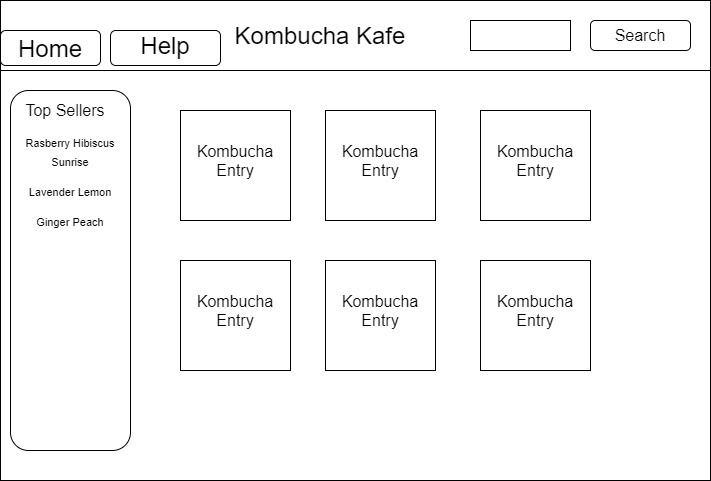
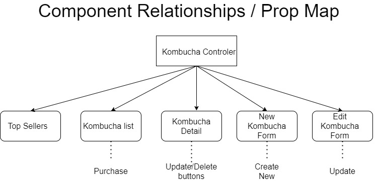

# <h1 align = "center"> Kombucha Kafe

## <h3 align = "center"> Single Page React Web Application

## <h2 align = "center"> About

 This is an application for a kombucha bar that manages beverages on tap, amount remaining in a keg, and popularity/number of times a drink has been ordered. It also allows for a user to order, add, delete, or alter a beverage. Uses Redux.

## <h2 align = "center"> Initial App Mockup

## <h2 align = "center"> Individual Kombucha Card Mockup

## **✅REQUIREMENTS**
* Install [Visual Studio Code](https://code.visualstudio.com/)

## **💻SETUP**
* to clone this content, copy the url provided by the 'clone or download' button in GitHub
* in command line use the command 'git clone (https://github.com/Scott-Ian/KombuchaKafe.git)'
* open the program in a code editor
* in the command/termminal line enter the command "npm start" to run the program
* if the project does not open on its own, in your preferred web-browser navigate to: localhost: 3000
__

## User Stories

* As a user, I want to see a list/menu of all available kegs. For each keg, I want to see its name, brewery, price, and description.
* As a suer, I want to submit a form to add a new keg to a list.
* As a user I want to be able to edit an existing beverage/keg.
* As a user, I want to see how many pints are left in a keg.
* As a user, I want to be able to click a button next to a keg whenever I sell a pint of it. This should decrease the number of p ints left by 1. Pints should not be able to go below 0.
* As a user, I want to be able to restock a keg, and have a fresh keg amount be represented in the system.
* As a user, I want to know how many times a drink has been ordered.
* As a user, I want a Top Sellers list to display the most popular beverages.

## <h2 align = "center"> Component Relationships

## Known Bugs

_There are some known bugs with the current version. The Top Sellers list does not always function as intended, and sometimes will display the least popular drinks, before reverting to the correct order after another order has been placed._ 

_Additionally, styling is not complete. I was having trouble integrating CSS grid with this REACT application. A further exploration I was not able to accomplish due to time limitations was implementing the search bar at the top of the screen to only display beverages whose name or description contain the search string._

## Support and contact details

Contact : Ian Scott

## Technologies Used

* JS
* React

## **📘 License**
